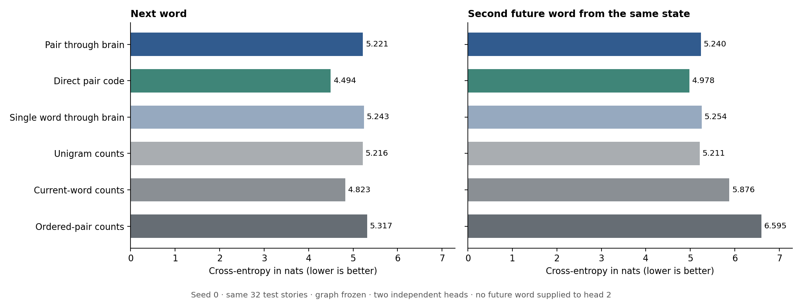

# Bigram input, two future words: completed macm3 pilot

**Pair input produced a small, inconsistent change across decoder seeds. The primary next-word perplexity moved from 189.16 to 185.11, while the same-sized decoder reading the pair codes directly reached 89.51. This run does not demonstrate a benefit from passing the codes through the current frozen-brain/readout configuration.**

The complete original Doomfly connectome remains frozen. The new interface encodes the previous and current word in distinct fixed retinal roles, advances one word per 20 ms interval, and predicts two unseen future words. The decoder has **526,336 trainable parameters**: two independent 256 → 1,024 affine softmax heads.

## Primary held-out comparison

All learned models below use seed 0, the same two-head capacity and validation-only epoch/L2 selection. The same 32 test stories yield 3,992 next-word targets and 3,960 second-future-word targets. The test set is reused from the earlier pilot for a paired developmental comparison. UNK makes up 11.62% and 11.67% of the respective horizon targets.

| Representation / reference | Next-word CE | Next-word PPL ↓ | Next-word accuracy | Second-word CE ↓ | Two-word exact accuracy |
|---|---:|---:|---:|---:|---:|
| Pair through brain | 5.2209 | 185.11 | 9.34% | 5.2404 | 1.59% |
| Direct pair code | 4.4944 | 89.51 | 19.21% | 4.9777 | 4.07% |
| Single word through brain | 5.2426 | 189.16 | 9.67% | 5.2539 | 2.78% |
| Unigram counts | 5.2158 | 184.15 | 6.41% | 5.2112 | 0.00% |
| Current-word counts | 4.8227 | 124.30 | 21.44% | 5.8760 | 5.48% |
| Ordered-pair counts | 5.3168 | 203.74 | 22.37% | 6.5947 | 6.59% |

The second head receives the same current features as the first head. Its loss does not condition on the true first future word. The ordered-pair count reference follows that same rule, with current-word/unigram backoff. Count smoothing is fixed at add-one unigram smoothing and backoff prior mass 1; it was not tuned on validation, so these are reference settings rather than optimized count models. Two-word exact accuracy uses only rows where both future targets exist.

These sliding forecasts overlap. We report each horizon separately; averaging the two losses is a forecast average, not ordinary sequence perplexity. Known-lexical scores exclude all four special symbols.

| Model | Seed | Next-word CE | Second-word CE | Combined forecast CE | Known-lexical combined CE |
|---|---:|---:|---:|---:|---:|
| brain | 0 | 5.2209 | 5.2404 | 5.2306 | 5.4894 |
| brain | 1 | 5.2409 | 5.2411 | 5.2410 | 5.4951 |
| brain | 2 | 5.2293 | 5.2505 | 5.2399 | 5.4936 |
| direct | 0 | 4.4944 | 4.9777 | 4.7351 | 4.9328 |
| direct | 1 | 4.5035 | 4.9649 | 4.7333 | 4.9323 |
| direct | 2 | 4.4960 | 4.9773 | 4.7357 | 4.9399 |
| single_word_brain | 0 | 5.2426 | 5.2539 | 5.2482 | 5.5093 |
| single_word_brain | 1 | 5.2289 | 5.2392 | 5.2341 | 5.4919 |
| single_word_brain | 2 | 5.2397 | 5.2626 | 5.2511 | 5.5107 |

## Paired uncertainty

Differences below are pair-through-brain CE minus the comparator CE; negative favors the brain with pair input. We resample entire stories together across systems, with 10,000 fixed-seed bootstrap replicates. Intervals are exploratory, unadjusted for multiple comparisons, and describe these reused pilot stories—not biological variability.

| Comparator | Next-word ΔCE | 95% story-bootstrap interval | Second-word ΔCE | 95% story-bootstrap interval |
|---|---:|---|---:|---|
| single_word_brain | -0.0217 | [-0.0434, +0.0003] | -0.0135 | [-0.0376, +0.0105] |
| direct | +0.7266 | [+0.6500, +0.8043] | +0.2626 | [+0.2021, +0.3219] |
| ordered_pair_counts | -0.0959 | [-0.2726, +0.0773] | -1.3543 | [-1.4776, -1.2337] |

## What changed and what stayed fixed

All 166,700 neurons, 25,582,938 directed edges and 124,177,617 synaptic contacts are retained in the original fixed NativeBrain baseline. The 0.1 ms timestep, warmup, drive intensity, delay, refractory behavior and neural readout projection are unchanged. Input roles illuminate 417 + 417 receptors, matching the original 834 total and its brightness budget. This supplies one explicit previous word at the sensory interface.

The direct control projects the identical retinal stimulus into 256 features using a fixed signed CountSketch, with no temporal memory. The single-word brain control reuses the earlier neural observations. No word embeddings or shared decoder trunk are learned. Training the second independent head cannot reshape the first head or the frozen brain.

Each of the three seeds selects epoch/L2 separately for each head from the fixed grid (0, 0.0001, 0.01), at most 30 epochs. All selections finish before test arrays are loaded. No architecture or training setting was changed based on this run’s test results. See [PAIR_PROTOCOL.md](PAIR_PROTOCOL.md).

## Runtime and verification

Feature extraction took **140.9 seconds** with four CPU workers on macm3. Decoder training and evaluation for all three representations, all three seeds and both heads took **154.8 seconds**. No GPU was required.

The full-graph probe checks repeatability, order sensitivity, disconnected inputs, equal stimulus energy, memoryless direct projection and frozen graph hashes. The post-training audit checks complete causal rows, source/cache hashes, exact direct-projection reconstruction, train-only standardization and independently recomputed checkpoint losses. The single-word control’s first head exactly reproduces the original checkpoint. **All checks passed, along with 50 lightweight tests.** Every post-BOS observation differs from the original word-encoding cache; 87 of 256 columns change. Both brain encodings have 4 varying spike-rate columns and 101 varying voltage columns. The new input did reach the simulation; these checks do not explain its limited predictive benefit.

## Fixed-seed paired generation

Both heads sample from the same state before either word is fed back. Then both successive sliding pairs pass through the brain. The original three prompts, seed 1729, temperature 0.8 and 24-word cap are retained. Samples remain incoherent. They are illustrative and were not selected for quality.

Prompt: `once upon a time`

> &lt;unk&gt; and a that decided delighted was and towards to the the a as he susie the it was the then for enough a

Prompt: `one day lily`

> me the they to her around was and they i the he to nobody named was the big bear had i to out one

Prompt: `the little dog`

> the &lt;unk&gt; &lt;unk&gt; the mommy teddy so in a flew was wanted the said and summer this wanted &lt;unk&gt; &lt;unk&gt; and snacks the but

## Interpretation limits

This experiment changes the external encoding while preserving the graph. A gain over the direct linear control could arise from nonlinear pair processing or older temporal state; it would not isolate biological topology. A negative result would not rule out better interfaces. Matched rewired graphs and a fresh, larger final evaluation remain untested.

Checkpoints, source receipts, predictions and full metrics are under `results/pair-pilot`. The primary checkpoint directory is `decoder/brain/seed-0`; it contains `head-0.pt`, `head-1.pt`, `pair.json` and the feature manifest. The original [single-word report](REPORT.md) remains unchanged.
