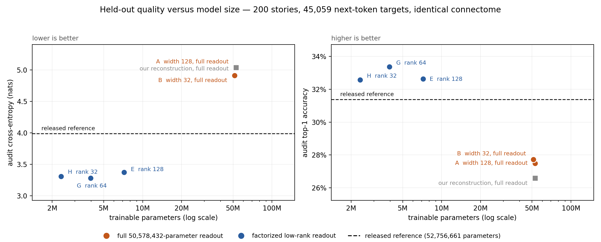

# Fly Wordbrain

**A language model whose recurrent layer is the measured wiring diagram of a fruit fly
brain — and an experiment in finding out how much of it was ever doing the work.**



We took a published fly-connectome language model, held its 49,393 neurons and 9,050,172
synapses completely fixed, and cut the learned machinery around them by **13.3×**. On a
held-out population that selected neither model, the small one is **0.708 nats better** in
cross-entropy and **1.99 accuracy points better** than the 52.7-million-parameter original.

That is a real measurement with a paired confidence interval. It is **not** evidence that
the fly's wiring is doing something clever. What it actually shows is more interesting, and
less flattering to the premise — see [What we did not find](#what-we-did-not-find).

### 🪰 [Hear it: **Fly Recital**](https://huggingface.co/spaces/fernandofernandes/fly-recital)

A fruit fly steps up to a microphone and reads you a story it is making up as it goes. The
model runs **in your browser tab** — ~120 lines of plain JavaScript, no inference runtime,
exact float32 weights, reproducing the PyTorch model token for token. The neuron cloud, the
state raster and the confidence waveform are measurements from the pass that just ran.

| | |
|---|---|
| **Demo** | [spaces/fernandofernandes/fly-recital](https://huggingface.co/spaces/fernandofernandes/fly-recital) |
| **Model** | [fly-wordbrain-rank64](https://huggingface.co/fernandofernandes/fly-wordbrain-rank64) · [rank32](https://huggingface.co/fernandofernandes/fly-wordbrain-rank32) |
| **Connectome** | [fly-connectome-49k](https://huggingface.co/datasets/fernandofernandes/fly-connectome-49k) |

---

## Where this came from

In 2026 Google Research and HHMI Janelia released the
[complete connectome of a male fruit fly](https://research.google/blog/a-connectomics-milestone-mapping-the-complete-male-fruit-fly-brain/):
every neuron, every synapse, measured. Within weeks people had wired it into things.
[Doomfly](https://github.com/nftechie/doomfly) put it behind a first-person shooter.
[FlyOCR](https://github.com/jerryjliu/fly_ocr) had it read characters.
[Xenova's simulation](https://huggingface.co/spaces/Xenova/fruit-fly-simulation) gave it a
body that walks and flies. Others had it play Mario.

Then [ngxson](https://huggingface.co/ngxson/fly-llm-hf) did the one that stuck with us:
**replace a transformer's blocks with the fly's wiring diagram and train it to write
bedtime stories.** It works. It rambles about Lily and Tom, and it is unmistakably
language.

We started at the other end — a frozen 166,700-neuron spiking brain as a word-prediction
feature extractor — and it lost to a bigram model
([Stage 1](experiments/01-doomfly-pilots/README.md), a string of clean negative results).
So we stopped inventing and reproduced ngxson's model exactly
([Stage 2](experiments/02-ngxson-reference/README.md)). That is where we noticed the thing
this repository is actually about.

## The question

Here is where the reference model's 52,756,661 learned parameters go:

| Component | Parameters | Share |
|---|---:|---:|
| Token embedding | 131,072 | 0.2% |
| Eight input projections | 1,800,192 | 3.4% |
| Neuron gain, recurrent gain, bias | 148,179 | 0.3% |
| Output LayerNorm | 98,786 | 0.2% |
| **Output readout matrix** | **50,578,432** | **95.9%** |

The connectome is a frozen buffer — it costs zero parameters. **95.9% of everything this
model learns is one 1024 × 49,393 output matrix** bolted onto the brain.

So: how much of the quality is the fly, and how much is that matrix? The way to find out is
to take the matrix away and see what survives.

## What we found

We shrank the interfaces and kept the brain untouched. Width 128 → 32 on the input
([Stage 3](experiments/03-encoder-compression/README.md)) was free. Then we replaced the
full readout with a factorized low-rank one — 49,393 → *r* → 1,024, no activation between,
every neuron still reaching the output
([Stage 4](experiments/04-decoder-compression/README.md)).

Holding encoder width fixed so **only the readout parameterization changes**:

| | full readout (B) | rank 64 (G) | change |
|---|---:|---:|---|
| trainable parameters | 51,308,213 | 3,956,469 | **12.97× fewer** |
| audit cross-entropy | 4.912468 | **3.280159** | **−1.632 nats** |
| audit perplexity | 135.97 | **26.58** | **5.12× lower** |
| audit top-1 accuracy | 27.7237% | **33.3740%** | **+5.65 points** |

Shrinking the readout did not cost quality — it **recovered** it. The 50.6M-parameter head
was memorising 1,000 short stories; constraining its rank regularizes it.

That effect is large enough to cross the reference model's line.
[Stage 5](experiments/05-shared-population/README.md) scores every model on one shared
200-story population (45,059 next-token targets) that selected none of our checkpoints:

| Model | Trainable | Audit CE | Audit acc | ΔCE vs reference (95% CI) |
|---|---:|---:|---:|---|
| released reference | 52,756,661 | 3.988231 | 31.3833% | — |
| our reconstruction | 52,756,661 | 5.036168 | 26.5807% | +1.048 [+1.015, +1.081] |
| A128fixed | 52,756,661 | 5.050346 | 27.4795% | +1.062 [+1.027, +1.098] |
| B32fixed | 51,308,213 | 4.912468 | 27.7237% | +0.924 [+0.890, +0.959] |
| E32rank128fixed | 7,183,157 | 3.373062 | 32.6350% | **−0.615** [−0.643, −0.588] |
| **G32rank64fixed** | **3,956,469** | **3.280159** | **33.3740%** | **−0.708** [−0.738, −0.679] |
| H32rank32fixed | 2,343,125 | 3.309095 | 32.5795% | **−0.679** [−0.711, −0.647] |

The split is by **readout**, not by size. Every full-readout arm sits above the reference on
cross-entropy; every low-rank arm sits below it, with intervals excluding zero on both
metrics.

The evaluator reproduces the previously published numbers bit-for-bit and replays every
arm's saved validation score to within 4.2e-08. The reserved 100-story test has never been
opened.

## What we did not find

**We did not show that the fly's connectome helps.** Every arm in that table runs on the
same frozen graph, so nothing in it separates "this wiring is a good prior for language"
from "this recurrent shape with a rank-constrained readout suits 1,000 short stories".
Answering that needs trained **randomized-graph and zero-edge controls** under the identical
recipe, multiple seeds, and a declared final-test protocol. We have not run them. Until
someone does, the honest reading of this work is a result about **readouts**, not about
flies.

**We did not modify the connectome — but the brain is not inert either.** These are two
different statements and both matter.

The *wiring* is untouched. Every endpoint, sign and stored synaptic weight in G and H is
byte-identical to the reference (`w_values` SHA256 `e6408887…`, plus six other graph
buffers). Not one edge was changed, and none was rewired.

The *neurons* are trained. Each of the 49,393 carries a learned input gain, recurrent gain
and bias — 148,179 parameters, **part of the reference architecture rather than something
we added** — and training moves them a long way. Rebuilding the initialization from the
recorded seed and diffing against the trained weights:

| Relative L2 change from initialization | G rank64 | H rank32 |
|---|---:|---:|
| `gain` (per-neuron input gain) | 58.66% | 60.57% |
| `rec_gain` (per-neuron recurrent gain) | 12.51% | 13.04% |
| **`gain × rec_gain`** (effective per-neuron scaling) | **50.61%** | **56.18%** |

`rec_gain` multiplies a neuron's *entire* incoming sum, so it rescales all of that neuron's
synapses by a single factor. It cannot change their relative strengths or their signs. The
connectome's structure is preserved; its per-neuron scale is learned. Measured by
[`scripts/measure_brain_displacement.py`](scripts/measure_brain_displacement.py), recorded in
[`experiments/records/`](experiments/records/G32rank64fixed-brain-displacement.json).

Arms that *would* have adapted individual synaptic strengths (±10%, still no rewiring) were
deferred and never run.

**We did not beat the reference at writing.** The numbers improved; the prose did not.
Across 24 generation records from G and H there are only 18 distinct texts, neither model
reliably holds a story premise, and contiguous overlap with training passages reaches 20
words. Low cross-entropy on TinyStories is not fluency.

**We did not reproduce the reference's training.** ngxson released neither the training
story IDs nor the full trainer. Our comparison against the released model is therefore
uncontrolled: different 1,000 stories, different recipe. If its training set overlaps our
audit population, its score here is *flattered* — which makes our margin conservative, not
inflated. We cannot check.

**128-word context was the original aspiration and has never been demonstrated.** The eight
delay slots supply recent tokens externally; that is not learned retention.

## The models

Two preserved checkpoints, both with the exact reference graph and both selectors retained:

- **G32rank64fixed** — 3,956,469 parameters (482,816 encoder, 3,226,688 decoder). The
  recommended baseline.
- **H32rank32fixed** — 2,343,125 parameters. 40.8% smaller than G, for 0.029 nats and 0.79
  accuracy points on the audit population.

We keep the **lowest-validation-CE** and **highest-validation-accuracy** weights as separate
artifacts and never merge them into a single fictional "best" checkpoint. Both selectors ship
for both models, with the checkpoint hashes from their accepted-stop receipts:
[rank64](https://huggingface.co/fernandofernandes/fly-wordbrain-rank64) ·
[rank32](https://huggingface.co/fernandofernandes/fly-wordbrain-rank32).

The connectome itself is published once, separately, as
**[fly-connectome-49k](https://huggingface.co/datasets/fernandofernandes/fly-connectome-49k)** —
the exact 49,393-neuron / 9,050,172-edge graph joined to MaleCNS body IDs, cell types,
superclasses and soma positions, with 18 standalone verification checks and the frozen-buffer
digests that prove which graph these weights were trained on. Until now it was reachable only
by parsing a 284 MB model checkpoint.

## How it works

One recurrent step per token, over all 49,393 neurons:

```
x = 0.1·x + 0.9·tanh( gain · (rec_gain · W·x + input) + bias )
```

`W` is the connectome: 9,050,172 signed, measured synaptic weights, frozen. Eight explicit
delay slots each project into 1,758 neurons, injecting the current token and the seven
before it. The readout sees every neuron's state. The tokenizer is a 1,024-token byte-level
BPE; stories are capped at 320 tokens.

Training ran on an Apple M3 Max through custom Metal sparse kernels — dynamic-value CSR
forward, transposed state backward, and batch-reduced edge gradients — which avoid both a
dense 49,393² adjacency and an edges × batch message tensor. Those kernels were packaged
and contributed upstream to [ConnecTorch](https://github.com/us/connectorch):

```python
import connectorch as ct
model = ct.nn.ConnectomeRNN(brain, weights="trainable", backend="metal_csr").to("mps")
```

## Reproduce it

[`docs/PIPELINE.md`](docs/PIPELINE.md) is the full path: pinned downloads, verified
anatomical groups, numerical preflight, training, checkpoint selection and evaluation.

```bash
python3.13 -m venv .venv-connectorch
.venv-connectorch/bin/python -m pip install -r requirements-connectorch.txt
.venv-connectorch/bin/python scripts/prepare_ngxson.py
.venv-connectorch/bin/python scripts/prepare_ngxson_data.py
```

The shared-population comparison in this README regenerates with:

```bash
python scripts/evaluate_compression_curve.py --model <reference-dir> \
  --groups data/connectorch-groups-v1/groups.npz \
  --training-data data/ngxson-tinystories-v1/dataset.json \
  --audit-data data/ngxson-quality-v1/dataset.json \
  --arms experiments/configs/compression-curve-arms.json \
  --output results/compression-curve-v2 --device mps
```

Configuration JSON files are **specifications, not runnable config files** — trainers take
explicit flags. Generated data and checkpoints stay outside Git; `results/` is ignored.

## The research trail

Every stage keeps its negative results, its stop receipts and its unedited generated text.

| Stage | Question | Answer |
|---|---|---|
| [1 — Doomfly pilots](experiments/01-doomfly-pilots/README.md) | Does a frozen spiking fly brain help predict words? | No. Lost to a bigram. |
| [2 — ngxson reference](experiments/02-ngxson-reference/README.md) | Can we reproduce a working fly LLM exactly? | Numerically yes; training quality no. |
| [3 — Encoder](experiments/03-encoder-compression/README.md) | How wide must the input interface be? | 32 is as good as 128. |
| [4 — Decoder](experiments/04-decoder-compression/README.md) | What happens without the 50.6M readout? | Quality improves. |
| [5 — Shared population](experiments/05-shared-population/README.md) | Are any of these numbers comparable? | They are now. |
| [Demo — `space/`](space/README.md) | Can it run, live, in a browser tab? | Yes, token-for-token exact. |

The [experiment registry](experiments/README.md) holds the arm table, recording rules and
interpretation rules. `experiments/records/` holds machine-readable receipts: selector
hashes, parity checks, source ancestry, stop decisions.

## Attribution

Connectome data: **MaleCNS v1.0, CC BY 4.0** — FlyEM / HHMI Janelia, University of
Cambridge, MRC Laboratory of Molecular Biology, Google Research. Architecture and tokenizer
from [ngxson/fly-llm-hf](https://huggingface.co/ngxson/fly-llm-hf) (CC BY 4.0). Text from
[TinyStories](https://huggingface.co/datasets/roneneldan/TinyStories) (CDLA-Sharing-1.0),
which we do not redistribute. Our code is MIT.

Full terms in [NOTICE.md](NOTICE.md).

The browser demo's source is in [`space/`](space/README.md); its forward pass
([`space/src/engine.js`](space/src/engine.js)) is held to a golden trace exported from
PyTorch by [`space/test/parity.mjs`](space/test/parity.mjs):

```bash
cd space && npm install
node test/parity.mjs ../results/web-model/G32rank64fixed ../../fly-connectome-49k
```
