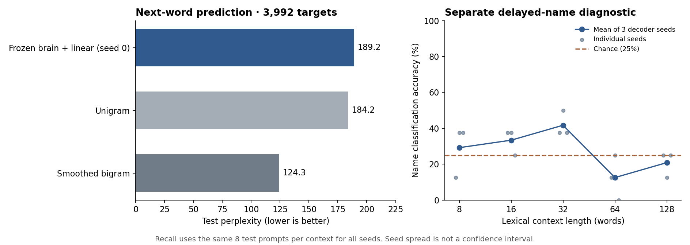

# First frozen-brain pilot on macm3

**The complete frozen graph runs and a small decoder trains successfully. This configuration did not beat unigram or bigram next-word perplexity, and did not establish reliable delayed-name recall.**

## Model and data

The unchanged original Doomfly `NativeBrain` baseline contains 166,700 neurons, 25,582,938 directed connections and 124,177,617 synaptic contacts. It is not the later v6 physiological model. All original graph edges and weights remain frozen; the original 0.1 ms timestep is retained.

Fixed equal-energy word codes stimulate 3,335 retinal inputs for 20 ms per word. A fixed projection reads spike rates and voltages from all 1,314 annotated descending neurons into 256 features. The sole language trainable component is **256 → 1,024 affine softmax: 263,168 parameters, about 1 MiB in float32**. There are no learned embeddings, hidden layers or decoder memory.

The pilot uses 128/32/32 disjoint TinyStories train/validation/test stories, with at most 128 lexical words per story. There are 16,017/3,991/3,992 scored next-word targets. Vocabulary is train-only. The natural-text test targets include 11.62% UNK; known lexical words cover 88.34% of retained test lexical words. The brain resets between stories.

## Held-out next-word results

| Model | Cross-entropy (nats) | Perplexity ↓ | Top-1 accuracy | Known lexical perplexity ↓ |
|---|---:|---:|---:|---:|
| Frozen brain + linear (seed 0) | 5.2426 | 189.16 | 9.67% | 244.77 |
| Unigram | 5.2158 | 184.15 | 6.41% | 236.86 |
| Smoothed bigram | 4.8227 | 124.30 | 21.44% | 149.15 |

All three decoder seeds are reported; seed 0 was designated primary before evaluation. Epoch/L2 selection used validation only. The references are fitted on the same training targets and vocabulary.

| Decoder seed | Selected L2 | Selected epoch | Test perplexity | Test accuracy |
|---|---:|---:|---:|---:|
| 0 | 0.01 | 25 | 189.16 | 9.67% |
| 1 | 0.01 | 15 | 186.59 | 10.40% |
| 2 | 0.01 | 18 | 188.62 | 8.37% |

The neural decoder has higher top-1 accuracy than the unigram reference, but worse cross-entropy/perplexity; the bigram reference wins on both. There is no overall predictive advantage in this pilot. Seed differences do not estimate uncertainty over new stories or biological samples.

## Separate name-memory diagnostic

A separate 1,028-parameter four-way linear classifier is trained on 80 synthetic prompts, selected on 40 validation prompts and tested on 40 held-out prompts. The four names are balanced; paired prompts differ only in the early name. This is a test of final-state decodability, not the natural-text decoder or natural-language query understanding.

| Context words | Seed 0 correct / 8 | Mean accuracy, 3 seeds | Mean CE (nats) |
|---|---:|---:|---:|
| 8 | 1/8 | 29.17% | 1.3865 |
| 16 | 3/8 | 33.33% | 1.3940 |
| 32 | 3/8 | 41.67% | 1.4337 |
| 64 | 1/8 | 12.50% | 1.6762 |
| 128 | 2/8 | 20.83% | 1.6301 |

Chance is 25% accuracy and a uniform classifier has CE 1.3863. Overall test accuracies for seeds 0/1/2 are 25%, 32.5%, and 25%; all three select epoch 1. At 128 words, mean accuracy is 20.83%. Only two paired test groups exist at each length. These observations do not establish reliable recall or a memory-capacity limit.

The query/filler templates are held out. Some carrier words map to UNK (including test `person`, `tell`, `moves`), equally across labels. A poor result cannot isolate forgetting from changes in input distribution or limitations of the fixed input/readout interface.

## Verification and runtime

- All three raw graph sources and the vendored Doomfly files match pinned upstream hashes.
- Every neuron/edge remains; per-story graph hashes stayed unchanged.
- Reset replay is exact; disconnected inputs ignore word identity; connected histories affect the readout.
- Two complete extractions produce bit-identical features and targets across all three splits.
- The deployed source matches the local source lock. Direct NumPy checkpoint evaluation matches logged CE within 1e-6.
- Every expected causal input/target pair is present exactly once. Only training statistics standardize features.
- 22 lightweight tests passed; the native full-graph checks and generation provenance checks also passed.

The verified language extraction took **151.6 seconds** with four CPU workers; all three decoder seeds and their L2 candidates took **29.1 seconds** in total. Hardware: M3 Max, 16 CPU cores, 128 GB unified memory. No GPU was required. These are small-pilot timings, not extrapolated large-corpus benchmarks.

An audit of the lower validation loss found 4.00% UNK training targets versus 12.10% validation targets. Reweighting validation losses to training UNK frequency changes CE from 5.1621 to 5.3398, versus training CE 5.4403. Thus coverage explains much of the inversion, with a remaining difference between the story samples. In the cached training features, 105 of 256 columns vary; the checkpoint logits respond to those features.

## Fixed-seed samples

Temperature 0.8; up to 24 new words; the same primary checkpoint and brain configuration; no sample selection. These outputs are not coherent language.

Prompt: `once upon a time`

> the a and of take watching was the wow was

Prompt: `one day lily`

> the a around she deaf the was a and at tree across a nice the in it was be was and so his the

Prompt: `the little dog`

> one was meow very said the went ran big you was up had the &lt;unk&gt; &lt;unk&gt; the scared mia that that a owl in

## Scope and artifacts

This is a completed first interface experiment. It neither establishes nor rules out a useful inductive bias in the biological topology. That claim requires matched rewired-graph controls, more data and interface comparisons. The preserved object is Doomfly’s directed graph and point-neuron dynamics, not a spatial cable model of biological morphology. Causal history sensitivity also includes the inherited retinal filter and is not equivalent to memory.

Artifacts are under `results/pilot-verified`: `decoder/checkpoint.pt`, `decoder/metrics.json`, `features/manifest.json`, `recall/report.json`, `generation.json`, `checkpoint-audit.json`, and `replay-check.json`. Full per-story caches and the original graph data remain on macm3 at `/Users/fernando/fly_wordbrain`.

See [README.md](../../README.md) for reproduction and [DATA_PROVENANCE.md](DATA_PROVENANCE.md) for source and tokenization details.
