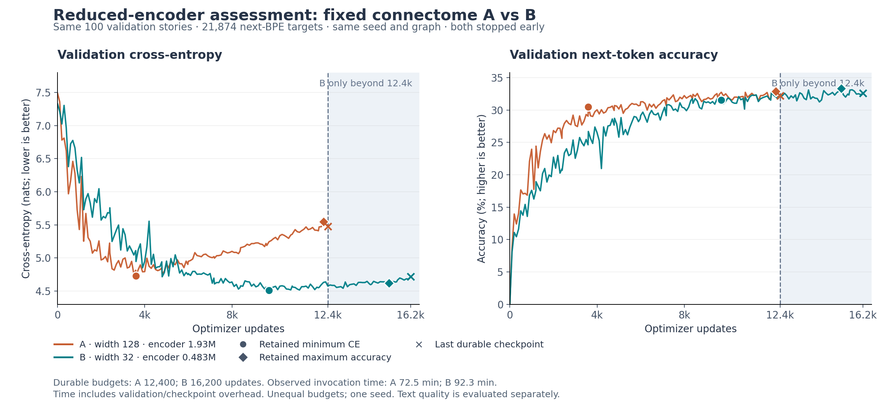

# Reduced encoder: post-B assessment

Keep the 482,816-parameter encoder. This experiment does not show a material
compression penalty requiring additional connection plasticity. The minimum
additional edge-gain count supported as necessary by this test is **zero**.
That is a decision for this dataset and architecture, not proof that extra brain
adaptation cannot improve performance.

B stopped under the user's standing plateau-stop authorization after 13 complete
epochs, 16,262 observed updates and 16,200 durable updates. A stopped after 10
epochs, 12,442 observed and 12,400 durable updates. Both independent winners and
resumable checkpoints are preserved. Neither arm completed its planned 44 epochs
or reached the second learning-rate phase. C128bounded and D32bounded remain held;
this is the requested post-B assessment, not the four-arm completion report.

## Validation and retained checkpoints

All scores are next-BPE-token prediction on the same 100 validation stories and
21,874 targets, using the released 1,024-token vocabulary. The training set has
1,000 stories. The reserved test remains untouched.

| Arm | Selector | Update | Validation CE | Accuracy |
|---|---|---:|---:|---:|
| A, encoder width 128 | Minimum CE | 3,600 | 4.72828 | 30.488% |
| A, encoder width 128 | Maximum accuracy | 12,200 | 5.54698 | 32.898% |
| B, encoder width 32 | Minimum CE | 9,700 | **4.51251** | **31.526%** |
| B, encoder width 32 | Maximum accuracy | 15,200 | **4.62185** | **33.314%** |

The retained B winners have lower CE and higher accuracy than their respective A
winners, but the later accuracy winner received more training. At the common
12,400-update budget, B's best CE is still 0.21577 lower; its best accuracy is
only 0.18744 percentage points lower (32.710% versus 32.898%). At exactly update
12,400, B is 0.90130 CE lower and 0.14629 points more accurate. These distinguish
best-through-budget from a single update. The historical B accuracy checkpoint
at 12,000 is no longer retained; its logged score is not an available weight file.

Our practical review flags were more than 0.10 CE or one accuracy point of loss,
or a clear decline in text coherence. The common-budget metrics do not trigger
them. They are descriptive thresholds, not significance or equivalence tests.

## Text quality

[All 24 unedited continuations and overlap measurements](encoder32-post-B-texts.md)
use six identical prompts, a fresh recurrent cache, BOS once, greedy decoding,
EOS stopping and at most 80 new BPE tokens for each checkpoint.

The samples do not show a consistent collapse after reducing the encoder. B's
maximum-accuracy checkpoint produces the most coherent opening for the generic
"Once upon a time" prompt: Lily wipes a table and ice cream begins to melt.
However, 39 consecutive continuation words match a training story. B's minimum-CE
version has a 31-word match. Those fluent openings are not clean evidence of
new-story generalization. No complete prompt-plus-continuation is an exact
normalized training prefix in this set.

Both sizes remain weak on the more specific prompts. The needle story drifts to
unrelated actions; neither retains the red ball's location in the box; bird/rain
and cake-sharing prompts lose subjects and grammatical structure. B starts the
Tom-and-dog story plausibly but later drifts to a rocket and birdcage. Some B
continuations are worse than A's on individual prompts. Six greedy samples
support keeping the small encoder for further experiments, not a broad claim of
text-quality equivalence or robust reasoning.

## What remained trainable and what was preserved

| Component | A width 128 | B width 32 |
|---|---:|---:|
| Encoder: embedding plus input projection | 1,931,264 | **482,816** |
| Neuron gain, recurrent gain and bias | 148,179 | 148,179 |
| Additional connection-gain parameters | 0 | 0 |
| Layer normalization | 98,786 | 98,786 |
| Decoder/readout | 50,578,432 | 50,578,432 |
| Total trainable parameters | 52,756,661 | **51,308,213** |

The encoder is 75% smaller; the complete trainable model is only 2.7455% smaller.
All 49,393 neurons and 9,050,172 canonical edge endpoints, stored weights and
signs are unchanged. The 148,179 neuron parameters already learn, so "fixed"
means fixed base edges, not a fully frozen recurrent network. Original neuron
gain/rec_gain values are unconstrained. Eight external input delays remain.

Measured invocation times were 72.46 minutes for A and 92.33 minutes for B,
including validation and checkpoint overhead and with different training
budgets. Through update 12,400 the recorded times were 72.26 and 70.85 minutes.
One run per configuration does not establish a kernel speedup. Historical peak
GPU memory was not recorded.

## Decision on additional brain plasticity

Keep width 32 and the current trained neuron dynamics. Do not increase the
encoder, unfreeze all 9.05M base weights, or add finer gains merely because the
encoder was compressed: the measured compression cost does not justify that.

If we test whether a small amount of connection adaptation improves quality,
the concrete existing candidate is **D32bounded** on `exp/encoder32-bounded`:
width 32, full readout, eight delays, fixed topology, and 18,322 source/destination
cell-type gains whose base-edge multipliers stay in [0.9, 1.1]. It raises trained
brain parameters from 148,179 to 166,501 and total parameters to 51,326,535.
C128bounded is the larger-encoder adaptive control. Any gain would currently be
a general adaptation benefit, not recovery of an observed encoder-compression
loss. Both runs remain held pending the next experiment decision.

Before escalating beyond that tier, verify optimizer wiring and actual updates,
input-drive coverage, recurrent/input scales, tanh saturation, gain saturation,
and changes in centered logits/probabilities. Use normalization-preserving,
magnitude-matched controls. A wider bound is justified only if useful gains
saturate; finer per-neuron source/destination gains (98,786 replacing 18,322)
remain an untested fallback. Shared gains can affect many edges; their parameter
count is not the percentage of synapses unfrozen.

## Best next workload-transfer target

The decoder still dominates model size. After this encoder decision, the largest
concrete reduction supported by existing code is a rank-128 readout, keeping
width 32 and eight delays constant: **6,453,376 decoder parameters** instead of
50,578,432, removing 44,125,056 parameters. Total size would be 7,183,157 with fixed
base edges, or 7,201,479 with the 18,322 bounded gains.

The recommended new pair is `E32rank128fixed` versus `F32rank128bounded`, proposed
branches `exp/encoder32-readout128-fixed` and `exp/encoder32-readout128-bounded`.
Use the same data, seed, optimizer schedule, validation selections and matched
update budgets. Apply the same CE/accuracy flags and matched text prompts; count
bounded adaptation as useful workload transfer only if it recovers quality lost
by the smaller head relative to the fixed-edge arm. This is a proposal, not a
launched run. Completing the held C/D full-head controls first remains useful
for separating a general adaptation benefit from a compression interaction.

The risk is that restricting output rank removes information the existing
recurrent state cannot recover. Later, reducing external history 8→4→2→1 while
preserving input-neuron coverage can test whether recurrent state can replace
explicit input history. Neither change proves an anatomical advantage without
matched randomized-topology controls and additional seeds.

## Verification and provenance

A separate inference-only helper ran serially on idle macm3/MPS. All four saved
checkpoints replayed the complete validation story, token and correct counts
exactly, with CE differences below 1e-4. Parameter and graph hashes stayed
unchanged, native forward kernels ran without CPU fallback, and backward-kernel
counts remained zero. The paused dispatcher was never resumed. No new training
ran during this assessment.

[Structured comparison](../records/encoder32-post-B-comparison.json),
[full inference results and hashes](../records/encoder32-post-B-quality.json),
and [B stop receipt](../records/B32fixed-stop-receipt.json) retain the evidence.
The pipeline code remains at the bound training source identity; evaluator and
report changes were added separately. Training outcomes use one seed and a small
validation set that also selected the checkpoints. They cannot establish that
fly anatomy supplies a language-learning advantage.
