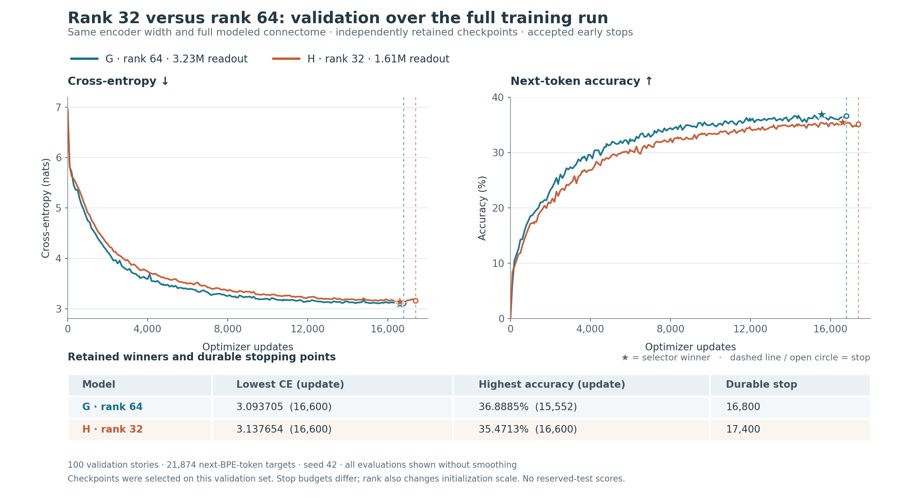

# Rank32 assessment: smaller decoder, measurable quality cost

Rank32 halves the decoder again and reduces total trainable parameters by
**40.78%**, while retaining the same encoder and anatomical graph. It carries a
measurable cost: **1.42 percentage points of best validation accuracy** and
**0.044 best cross-entropy** relative to rank64. The matched story samples also
show additional fluency and repetition problems on several prompts, although
regression is not uniform. Keep rank64 as the quality baseline and retain rank32
as the smaller comparison model.

Both runs stopped under the same operational plateau rule after 14 completed
epochs. H stopped at 17,409 observed / 17,400 durable updates; G stopped at
16,808 / 16,800. H's two independent selectors chose the same weights at 16,600.
The full planned 30+14-epoch schedule was not completed. All actual training and
quality inference ran serially on macm3.

## Compression and retained validation winners

| Measure | G rank64 | H rank32 |
|---|---:|---:|
| Encoder parameters | 482,816 | 482,816 |
| Decoder parameters | 3,226,688 | 1,613,344 |
| Neuron gains and biases | 148,179 | 148,179 |
| Output LayerNorm | 98,786 | 98,786 |
| Total trainable | 3,956,469 | 2,343,125 |
| Lowest validation CE | 3.093705 @ 16,600 | 3.137654 @ 16,600 |
| Highest validation accuracy | 36.8885% @ 15,552 | 35.4713% @ 16,600 |

CE and accuracy in the last two rows are independently selected bests, not a
single invented checkpoint. At the CE-selected checkpoints, accuracy is
36.3674% for G and 35.4713% for H: a 0.8960-point loss. At the accuracy-selected
checkpoints, CE is 3.103450 for G and 3.137654 for H: a 0.034204 increase, with a
1.4172-point accuracy loss. That accuracy loss exceeds the previously established
one-point review flag; the CE changes remain below the 0.10 flag. These flags are
practical review thresholds, not significance tests.

## Equal training exposure

The last shared validation budget is **16,800 updates / 3,295,559 actual
non-padding training targets**. At that exact point, H has CE 3.150774 and
accuracy 35.3342%, versus G's 3.108550 and 36.5777%: +0.042224 CE and
−1.2435 accuracy points. Both models' retained winners in the table above were
already available by this common budget.

Every logged training chunk was checked against the seeded batching/TBPTT
recipe. H's final durable exposure is 3,412,893 targets; G's is 3,295,559. The
CE-selected pair has equal exposure of 3,257,286 targets at 16,600 updates.
G's accuracy winner has 3,052,348 targets at 15,552, while H's has 3,257,286.
The additional H training is therefore visible rather than treated as equal.

## Native checkpoint quality checks

The four selector replays completed on an idle Apple M3 GPU at
2026-09-16 02:36:21 UTC. All replayed the complete 100-story, 21,874-target
selection-validation population, with **exact correct counts**. Maximum absolute
CE difference from the original training receipt was **1.62144×10⁻⁸**. Each
checkpoint used the correct rank-specific tensor shapes. H's two files have
separate byte hashes but identical model parameters and generated samples.

The evaluator verified accepted stops and exited training workers, experiment
branch/config/source ancestry, original parity and optimizer-smoke receipts,
checkpoint contents, installed ConnecTorch identity, and all graph hashes.
The four inference passes used native Metal with zero backward kernel calls,
zero optimizer steps and no host fallback. Parameters, canonical graph buffers,
checkpoint files and other bound artifacts remained unchanged. The evaluation
worker exited after completion. The reserved test set remains unused.

See the [machine-readable assessment](../records/rank32-post-H-assessment.json),
[evaluator launch receipt](../records/rank32-quality-launch.json), and
[accepted-stop report](H32rank32fixed-accepted-early-stop.md). The raw result SHA256
is `db535a12c6e76d72633ce8b0af76db37047b00029a85821865af94063eba2beb`.

## Story quality

The [unedited continuations](rank32-generated-texts.md) cover six identical
prompts, both selectors and both ranks, with greedy decoding, fresh caches and
at most 80 new BPE tokens. There are 24 records but only **18 distinct texts**,
because H's two selectors use identical weights. The
[qualitative review](rank32-text-review.md) examines every prompt.

H adds visible weaknesses in the generic Lily, Tom-and-dog and bird prompts.
The Tom-and-dog continuation ends quickly with the malformed phrase
“a big to bennn”; the bird example repeats “hugest” and loses its original
characters. G also has substantial drift and grammatical errors, so this is
not a contrast with a fluent language model. H's Sara continuation is locally
steadier but still abandons the ball-in-box premise. Needle and cake comparisons
are mixed. The samples support a real tradeoff, not a claim of uniform collapse
or equivalence.

Longest contiguous training phrase overlap reaches 12 whitespace words for H,
12 for G's CE winner and 20 for G's accuracy winner. No complete prompt plus
continuation is a normalized training prefix. Phrase overlap and six prompts
are insufficient to rule out memorization or establish generalization.

## How the modeled brain changed

All **49,393 neuron identities and 9,050,172 canonical edge endpoints and stored
weights** remain byte-identical, including input/output and anatomical grouping
buffers. The graph topology was not rewired. The 148,179 neuron gain,
recurrent-gain and bias parameters did train, so fixed edges do not mean frozen
dynamics.

Relative to H's own initialization, gain changes have 60.57% relative-L2 norm,
recurrent-gain changes 13.04%, and bias changes an absolute RMS of 0.09158.
The product gain × recurrent-gain changes by 56.18% relative L2. This product
describes scaling before the recurrent nonlinearity; it is not a percentage of
rewired connections or a measurement of brain workload.

At the equal-update CE-selected checkpoints, H versus G differs by 27.29%
relative L2 in gain, 0.0299% in recurrent gain, and 0.12142 absolute bias RMS.
Their gain × recurrent-gain products differ by 23.32% relative L2. The initial
encoder and neuron parameters were identical; decoder shapes and initial logit
variance differ across ranks. Parameter differences alone cannot establish that
computation shifted from the decoder into the connectome.

## Recommended next comparison

Use **G rank64 as the quality baseline**. H rank32 is a useful size/quality
tradeoff, but these results do not justify calling it equivalent or shrinking
further without a recovery experiment.

If the user selects it, the smallest next anatomical-capacity comparison is
rank32 with the existing **18,322 factorized source/target cell-type gain
parameters**. Keep encoder width, decoder rank, neurons, edge endpoints, data
and training recipe fixed; initialize the additional synaptic multiplier to
one and bound it to ±10% around each stored base weight. This would bring total
trainable parameters to **2,361,447**, about 0.78% more than H, and permit shared
synaptic changes without adding edges. Existing neuron gains remain trainable;
the ±10% bound applies to the additional synaptic multiplier, not all effective
recurrent dynamics. Compare against H to test whether this limited change can
recover accuracy and story quality. This proposal is not yet selected or queued.

This remains one seed on a small checkpoint-selection validation set. It does
not establish anatomical advantage, independent test performance, or a causal
transfer of language computation into the brain. Later training or the unvisited
learning-rate phase could still improve either arm. No further training run is
selected by this assessment.
