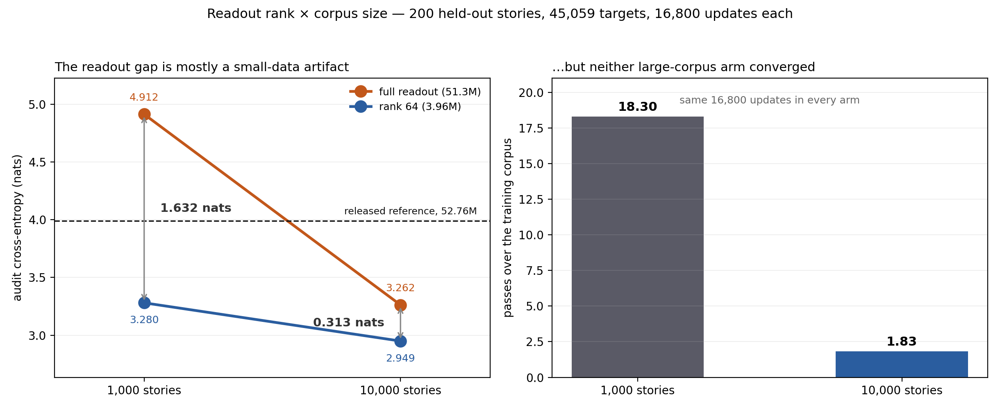

# Stage 6 — Was the readout advantage just a small corpus?

**Objective.** [Stage 4](../04-decoder-compression/README.md) found that replacing a
50.6M-parameter readout with a rank-64 one *improved* held-out quality by 1.632 nats, and
explained it as regularisation: the big head was memorising 1,000 short stories. That
explanation makes a falsifiable prediction — **give the full readout ten times the data and
most of its disadvantage should disappear.**

This stage tests our own claim, and the claim mostly survives contact. Mostly.

## Design

A 2×2 over readout parameterization and corpus size, reusing the two Stage 4 arms:

| | 1,000 stories | 10,000 stories |
|---|---|---|
| **full readout** (51,308,213) | B32fixed | **J32fullfixed10k** |
| **rank 64** (3,956,469) | G32rank64fixed | **I32rank64fixed10k** |

Every arm gets **exactly 16,800 updates**. Matching epochs would have broken the
comparison — G planned a 52,609-update cosine and consumed 31.9% of it, so the 10k arms
plan 4+2 epochs (~55,122 updates) and consume 30.5%. Same compute, same learning-rate
trajectory, only the corpus differs.

The corpus is built by
[`scripts/prepare_ngxson_data_large.py`](../../scripts/prepare_ngxson_data_large.py) with
three properties that make the comparison clean:

- The 10,000-story set is a **strict superset** of the 1,000-story set, in the same order.
- Validation, test and audit rows are **copied verbatim**, so every score is directly
  comparable to what Stages 4 and 5 published.
- Training draws from the official *train* split while validation, test and audit all come
  from the official *validation* split. Eight checks assert it: no shared ID, no shared
  normalised text digest, reserved splits unchanged.

Rows come from the dataset's parquet shards because the row API rate-limits sustained
paging. The two orderings must agree for story IDs to stay comparable, so the builder
**verifies parquet against 10,200 independently cached row-API rows** before trusting them.

## Result

200 held-out stories, 45,059 next-token targets, a population that selected no checkpoint.

| Arm | Parameters | Audit CE | PPL | Top-1 | ΔCE vs reference (95% CI) |
|---|---:|---:|---:|---:|---|
| released reference | 52,756,661 | 3.9882 | 53.96 | 31.38% | — |
| B full readout, 1k | 51,308,213 | 4.9125 | 135.97 | 27.72% | +0.924 [+0.890, +0.959] |
| G rank 64, 1k | 3,956,469 | 3.2802 | 26.58 | 33.37% | −0.708 [−0.738, −0.679] |
| J full readout, 10k | 51,308,213 | 3.2619 | 26.10 | 35.76% | −0.726 [−0.765, −0.687] |
| **I rank 64, 10k** | **3,956,469** | **2.9493** | **19.09** | **37.43%** | **−1.039** [−1.078, −1.001] |

**The readout gap collapsed from 1.6323 to 0.3126 nats — 80.8% of it was a small-data
artifact.** The accuracy gap fell the same way, +5.65 to +1.67 points.

The mechanism shows up directly in how much each arm gained from the extra data:

| | data effect (1k → 10k) |
|---|---:|
| full readout | **−1.6505 nats** |
| rank 64 | −0.3308 nats |

Ten times the text helps the 50.6M-parameter head **5.0× more** than the 3.2M one. That is
what a memorising head looks like when you finally give it enough to generalise from.

## What survives, and what it might be instead

A residual advantage remains: **0.3126 nats and 1.67 accuracy points** at matched compute,
and the 3,956,469-parameter model is still the best of the four — now **1.039 nats** below
the released 52,756,661-parameter reference.

**But neither 10k arm converged.** 16,800 updates is 18.3 passes over 1,000 stories and only
**1.83** over 10,000. The residual gap is therefore consistent with two different stories:

1. a genuine remaining quality advantage for the constrained readout, or
2. a **convergence-rate** difference — the smaller model simply reaching its plateau in
   fewer updates.

Nothing here separates them. Doing so means training both to convergence on the larger
corpus, which is several times this budget. Until then the honest claim is bounded: the
large majority of the Stage 4 effect was scarcity, and what is left is unresolved.

Both 10k arms are budget-capped, so the trainer records them as `debug_stopped` with
`debug: true`. That flags the update cap, not a failure.

## Unchanged

Still no randomized-graph or zero-edge control, so none of this speaks to whether the
connectome contributes anything. The reserved 100-story test remains unopened; the audit
population was revealed by an earlier audit and is no longer untouched.

Receipts: [`records/corpus10k-v1.json`](../records/corpus10k-v1.json), arm configurations
[`I`](../configs/I32rank64fixed10k.json) and [`J`](../configs/J32fullfixed10k.json).
