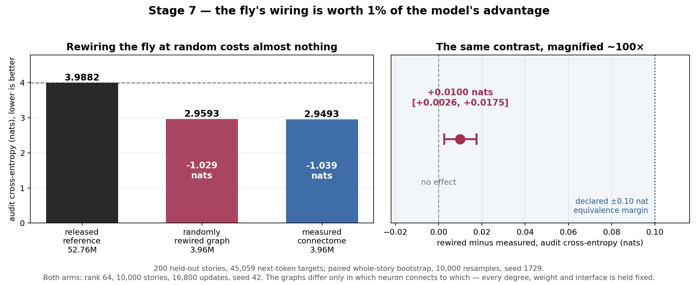

# Stage 7 — Does the fly's wiring actually matter?

**Objective.** Every result in Stages 1–6 runs on the same measured connectome, so not one
of them can separate two very different claims:

1. **the fly's wiring is a good prior for language**, or
2. **a sparse recurrent layer of roughly this shape and density suits short stories**, and
   the particular anatomy is incidental.

Six stages of ablations refined *what we attach to the brain* and never once questioned the
brain. This stage is the control that can tell those apart, and it is the single largest gap
in the repository — it is flagged in the hero of the README, in the limits section, and in
all four model cards.

## Design

One arm, **K32rank64shuffled10k**, matched to [arm I](../configs/I32rank64fixed10k.json) —
the best model in the repository — in every respect except the graph:

| | I32rank64fixed10k | K32rank64shuffled10k |
|---|---|---|
| graph | measured MaleCNS connectome | **the same graph, rewired at random** |
| readout | rank 64 (3,956,469 params) | rank 64 (3,956,469 params) |
| corpus | 10,000 stories | 10,000 stories |
| updates | 16,800 | 16,800 |
| seed | 42 | 42 |
| everything else | — | identical |

If K scores like I, the anatomy contributes nothing beyond its connectivity statistics, and
every claim in this repository is a claim about sparse recurrence rather than about a fly.
If K scores clearly worse, the specific wiring is carrying real signal.

### What "rewired at random" has to mean

A shuffle that also changed the degree distribution would be useless: a null result could
then be explained by the damage rather than by the anatomy being uninformative. So the
control is built to hold every connectivity statistic fixed and destroy only the pairing.

[`scripts/train_connectorch_control.py`](../../scripts/train_connectorch_control.py)
globally permutes the presynaptic index array, then repairs the self-loops and duplicate
edges that a permutation inevitably creates. A repair swaps the source values of two edge
slots, which leaves both row offsets and the out-degree multiset untouched by construction.

| | |
|---|---|
| **preserved exactly** | every neuron's in-degree (the row offsets are never written) |
| | every neuron's out-degree |
| | every edge weight, and each neuron's incoming weight multiset |
| | the input-injection and readout interfaces |
| **destroyed** | which particular neuron connects to which |

Measured on the real 49,393-neuron, 9,050,172-edge graph:

| | |
|---|---:|
| edges rewired | **99.9964%** |
| edges landing back on their original source | 325 |
| original edges surviving at both endpoints | 118,705 (1.31%) |
| slots repaired | 59,116 |
| self-loops | **0** |
| duplicate edges | **0** |
| in-degree / out-degree identical | **yes / yes** |

Those invariants are enforced by
[`tests/test_graph_control.py`](../../tests/test_graph_control.py), not just checked once by
hand. The zero-duplicate requirement is load-bearing rather than cosmetic: the Metal sparse
backend refuses to coalesce topology and raises on a single duplicate edge, which is how an
earlier version of this control failed.

### Keeping the control honest

The trainer is never edited. The control patches the two seams where the reference graph
enters — model construction, and the cell-type grouping's graph-identity check — so the
recipe, the optimizer and every audit stay byte-identical to the arm being controlled. It
rewires *before* the trainer hashes the reference, so the trainer's own
"adaptation changed a frozen buffer" guard still protects the run.

Scoring is the part that is easy to get quietly wrong. A checkpoint trained on the shuffled
graph, loaded onto the fly's real graph, would produce a number that means nothing. The
evaluator therefore **rebuilds the control graph from its declared seed** and then checks it
against the digests recorded in the checkpoint, using the same `control_indices` function
the trainer used. The check passes only if the scoring process independently reproduced, bit
for bit, the graph the arm actually trained on.

K is scored *before* I in the same invocation, and I must reproduce its published audit CE
of 2.9493 exactly. That ordering is deliberate: if rewiring ever leaked into the shared CPU
reference the other arms are built from, I would be scored on a damaged graph and its replay
gate would catch it.

## Result

**The fly's wiring is worth about 1% of this model's advantage.**

200 held-out stories, 45,059 next-token targets — the same population Stages 5 and 6 used,
which selected no checkpoint for any arm.

| Arm | Parameters | Audit CE | PPL | Top-1 | ΔCE vs reference (95% CI) |
|---|---:|---:|---:|---:|---|
| released reference | 52,756,661 | 3.9882 | 53.96 | 31.38% | — |
| **K — randomly rewired** | 3,956,469 | 2.9593 | 19.29 | 36.52% | −1.029 [−1.068, −0.990] |
| **I — measured connectome** | 3,956,469 | **2.9493** | **19.09** | **37.43%** | −1.039 [−1.078, −1.001] |

The contrast that answers the question is K against I, paired over the same stories
(10,000 whole-story resamples, seed 1729):

| | K minus I | 95% CI |
|---|---:|---|
| cross-entropy | **+0.0100 nats** | [+0.0026, +0.0175] |
| top-1 accuracy | **−0.91 points** | [−1.20, −0.63] |

**Both intervals exclude zero, so the specific wiring is carrying real signal — and it is
very small.** Arm I beats the released reference by 1.039 nats. Destroying which neuron
connects to which, while holding every in-degree, every out-degree, every synaptic weight
and both interfaces fixed, costs **0.0100 nats — 0.96% of that advantage.**

The same comparison clears the ±0.10 nat and ±0.02 accuracy equivalence margins two-sided.
Those margins were declared in the original protocol for the released-reference comparison
and are reused here rather than invented for this result, but on their terms a randomly
rewired fruit-fly brain is *statistically equivalent* to the real one.

### Accuracy behaves differently from cross-entropy

The anatomy buys much more top-1 accuracy than it buys likelihood:

| | gain over released reference | share attributable to the wiring |
|---|---:|---:|
| cross-entropy | 1.039 nats | **0.96%** |
| top-1 accuracy | +6.05 points | **15.1%** |

Rewiring costs 0.91 of the 6.05 accuracy points but only 0.010 of the 1.039 nats. The
measured graph sharpens which token comes first without much changing the distribution over
the rest — a real effect, and a narrow one.

### Validation overstates the gap

On validation the same contrast is **+0.0244 nats** [+0.0145, +0.0341] and −1.29 points,
more than twice the audit gap. Validation selected both checkpoints, so some of that is
selection noise rather than anatomy; the held-out number is the one to quote.

## What this settles, and what it does not

It settles the largest open question in this repository. Stages 1–6 could not distinguish
"the fly's wiring is a good prior for language" from "a sparse recurrent layer of this
shape suits short stories". **It is overwhelmingly the second.** The headline result — 3.96M
parameters beating a 52.76M-parameter reference by 1.039 nats — is a readout-and-training
result running on a sparse recurrent substrate whose *degree structure* does nearly all the
structural work. Nothing about the measured pairing of neurons accounts for more than a
percent of it.

It does not settle what the recurrence contributes. K keeps the same 9,050,172 edges,
densities and weights as I; both arms could still be relying heavily on having a large
sparse recurrent state at all. Bounding that needs a zero-edge arm, which this stage does
not run.

Other limits, stated plainly: **one seed and one shuffle.** A degree-preserving global
permutation is a strong randomisation but not the only one, and a second seed would show how
much of the 0.0100 nats is run-to-run noise. Both arms remain budget-capped at 1.83 passes
over the corpus, so this is a matched-budget comparison, not a converged one.

Arm K is budget-capped, so the trainer records it as `debug_stopped` with `debug: true`.
That flags the update cap, not a failure.

## Receipts

Arm configuration [`K32rank64shuffled10k`](../configs/K32rank64shuffled10k.json), and a
provenance record of one rule broken during this stage and how it was resolved:
[`K32rank64shuffled10k-provenance.json`](../records/K32rank64shuffled10k-provenance.json).
